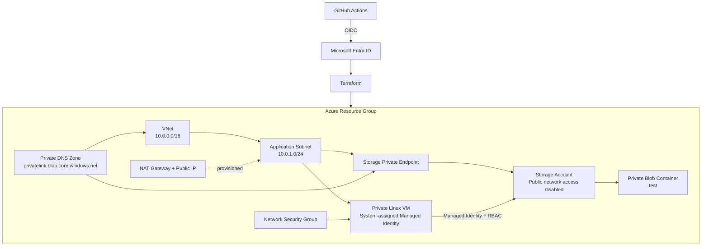

# Terraform Azure Private VM with Managed Identity and Private Storage

This project provisions a private Azure Linux VM and a private Azure Storage Account using Terraform. It focuses on private connectivity, passwordless workload identity, least-privilege RBAC, and GitHub Actions authentication to Azure using OIDC.

The project was built as a hands-on Azure infrastructure lab to validate the difference between **network connectivity**, **identity**, and **authorization** rather than only provisioning resources.

## Architecture



> **Current implementation note:** the NAT Gateway and its Public IP are provisioned, but the uploaded Terraform configuration does not currently associate the NAT Gateway with the application subnet. See **Known improvement** below.

## What this project demonstrates

- Azure infrastructure provisioning with Terraform
- Remote Terraform state stored in Azure Storage using Azure AD authentication
- GitHub Actions authentication to Azure using OIDC instead of a long-lived client secret
- A Linux VM with no public IP
- Password authentication disabled on the VM
- System-assigned Managed Identity for workload authentication
- Azure RBAC scoped to the Storage Account
- Storage public network access disabled
- Azure Private Endpoint for Blob Storage
- Private DNS integration for `privatelink.blob.core.windows.net`
- VM management through Azure Run Command rather than inbound SSH
- Validation of least-privilege access using successful and intentionally denied Blob operations

## Repository structure

```text
.
├── .github/
│   └── workflows/
│       ├── azure-oidc-test.yml
│       └── terraform-apply.yml
├── terraform/
│   ├── keys/
│   │   └── dummy.pub
│   ├── main.tf
│   ├── network.tf
│   ├── nsg.tf
│   ├── storage.tf
│   └── vm.tf
└── README.md
```

## Security design

### Private VM

The VM has no public IP and the NSG contains no inbound SSH rule. Password authentication is disabled.

Azure requires an SSH public key in the Linux VM resource configuration, so this lab uses a dummy public key only to satisfy the provisioning requirement. The corresponding private key is not retained and SSH is not used as the management path.

Administrative testing is performed with **Azure VM Run Command** through the Azure control plane.

### Managed Identity instead of storage credentials

The VM uses a system-assigned Managed Identity. Terraform grants that identity only:

```text
Storage Blob Data Reader
```

at the Storage Account scope.

The VM can therefore request an Azure access token without storing a Storage Account key, client secret, or other long-lived application credential on the VM.

### Private Storage access

The Storage Account has public network access disabled. Blob traffic is exposed privately through an Azure Private Endpoint and the Azure Private DNS zone:

```text
privatelink.blob.core.windows.net
```

This keeps the Storage data-plane path on private Azure networking.

### GitHub Actions OIDC

GitHub Actions authenticates to Azure using OpenID Connect. The workflow requires only GitHub repository secrets containing identifiers such as the Azure client, tenant, and subscription IDs; it does not require an Azure client secret.

The deployment identity and the existing Resource Group are treated as bootstrap resources outside this Terraform configuration. The Resource Group is referenced with a Terraform data source rather than created or destroyed by this project.

## Terraform state

Terraform uses an Azure Storage backend:

```hcl
backend "azurerm" {
  resource_group_name  = "rg-terraform-state"
  storage_account_name = "kawamuratfstatestorage"
  container_name       = "tfstate"
  key                  = "terraform.tfstate"
  use_azuread_auth     = true
}
```

The state Storage Account and its access permissions must exist before `terraform init`.

## Deployment workflow

The current Terraform workflow is manually triggered with `workflow_dispatch` and performs:

```text
Checkout
  ↓
Azure Login with OIDC
  ↓
Terraform Init
  ↓
Terraform Format Check
  ↓
Terraform Validate
  ↓
Terraform Plan
  ↓
Terraform Apply
```

This keeps Azure authentication keyless while allowing the Terraform configuration to be validated before deployment.

## Validation performed

The environment was tested from inside the private VM rather than assuming that a successful Terraform apply proved end-to-end access.

### 1. VM management without inbound SSH

Azure Run Command successfully executed commands on the VM and confirmed its private interface address.

```text
VM private address: 10.0.1.4
```

### 2. Private DNS and Private Endpoint

Resolving the Storage Blob endpoint from the VM returned the Private Endpoint address:

```text
Storage FQDN
  → privatelink.blob.core.windows.net
  → 10.0.1.5
```

This confirmed that Blob Storage was being resolved through the configured Private DNS zone and Private Endpoint.

### 3. Managed Identity token acquisition

The VM successfully requested an OAuth access token from the Azure Instance Metadata Service (IMDS) using its system-assigned Managed Identity.

No Storage Account key or application secret was required.

### 4. RBAC negative test — PUT denied

With only `Storage Blob Data Reader`, the VM attempted to upload a Blob.

```text
PUT /test/test.txt
HTTP 403
AuthorizationPermissionMismatch
```

This was an expected failure and demonstrated that network connectivity and successful authentication do not automatically grant write authorization.

### 5. RBAC positive test — GET allowed

A test Blob was created during a controlled temporary write-access test. The temporary write permission was then removed, returning the VM to its Terraform-managed Reader role.

The VM subsequently retrieved the Blob using its Managed Identity:

```text
GET /test/test.txt
HTTP 200
Hello from vm-app
```

The final behavior was therefore:

| Test | Result | Meaning |
|---|---|---|
| Private DNS resolution | Private IP returned | Private Endpoint DNS path works |
| Managed Identity token request | Success | VM identity works |
| Blob PUT with Reader role | `403` | RBAC blocks unauthorized writes |
| Blob GET with Reader role | `200` | RBAC permits authorized reads |

These tests separate three common troubleshooting layers:

```text
Network path  →  Identity  →  Authorization
```

## Bootstrap requirements

The following resources and permissions are intentionally outside this Terraform configuration:

- Azure subscription
- `rg-azure-lab` Resource Group
- Terraform state Resource Group and Storage Account
- Microsoft Entra application / service principal used by GitHub Actions
- GitHub-to-Azure federated identity credential
- Required RBAC for the GitHub Actions deployment identity

Keeping the application Resource Group outside the project means `terraform destroy` can remove the lab resources without also deleting the permission boundary required for future deployments.

## Known improvement

The Terraform configuration currently creates a NAT Gateway and associates a Public IP with it, but it does **not** contain an `azurerm_subnet_nat_gateway_association` resource. As a result, the NAT Gateway is not attached to `snet-app` in the uploaded version.

The intended association is:

```hcl
resource "azurerm_subnet_nat_gateway_association" "main" {
  subnet_id      = azurerm_subnet.main.id
  nat_gateway_id = azurerm_nat_gateway.main.id
}
```

This should be added before describing the VM subnet as using the NAT Gateway for outbound Internet access.

## Cleanup

After testing, destroy the Terraform-managed lab resources to avoid unnecessary Azure charges:

```bash
cd terraform
terraform destroy
```

The bootstrap Resource Group and remote-state resources are intentionally not destroyed by this project.

## Key takeaway

The main goal of this project is not simply to create an Azure VM. It demonstrates an Azure access path where:

```text
Private network connectivity
        +
Managed Identity authentication
        +
Least-privilege Azure RBAC
        =
Private, credential-free Storage access
```

It also validates failure behavior so that network, identity, and authorization problems can be distinguished during troubleshooting.
