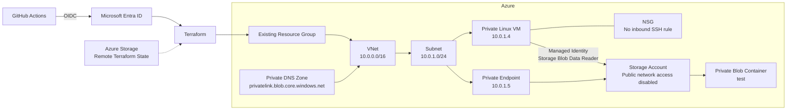

# Terraform Azure Private VM with Managed Identity and Private Storage

This project builds a small private Azure environment with Terraform and uses it to test how **network connectivity, workload identity, and authorization** interact in Azure.

Rather than stopping at a successful `terraform apply`, the lab validates the access path from a private Linux VM to Azure Blob Storage, including both successful and intentionally denied operations.

## Architecture



The repository also provisions a NAT Gateway and Standard Public IP. These were introduced during the earlier public-access phase of the lab; the final Storage access path is through the Private Endpoint. The current Terraform does not associate the NAT Gateway with `snet-app`.

## What this project demonstrates

- Azure infrastructure provisioning with Terraform
- Remote Terraform state in Azure Storage using Microsoft Entra authentication
- GitHub Actions → Azure authentication with OIDC and no client secret
- Private Linux VM with no public IP
- No inbound SSH rule and password authentication disabled
- Azure VM Run Command as the management/test path
- System-assigned Managed Identity for workload authentication
- Least-privilege Azure RBAC at Storage Account scope
- Storage Account with public network access disabled
- Blob Storage Private Endpoint and Private DNS integration
- CI workflow with PR planning and deployment from `main`
- Manually triggered destroy workflow with explicit confirmation and a protected GitHub Environment
- Positive and negative tests that distinguish connectivity, identity, and authorization failures

## Repository structure

```text
.
├── .github/
│   └── workflows/
│       ├── azure-oidc-test.yml
│       ├── terraform-apply.yml
│       └── terraform-destroy.yml
├── terraform/
│   ├── keys/
│   │   └── dummy.pub
│   ├── main.tf
│   ├── network.tf
│   ├── nsg.tf
│   ├── storage.tf
│   └── vm.tf
└── README.md
```

## Design decisions

### 1. Bootstrap resources are kept outside the workload Terraform

The workload Resource Group (`rg-azure-lab`) already exists and is referenced as a data source:

```hcl
data "azurerm_resource_group" "main" {
  name = "rg-azure-lab"
}
```

The GitHub deployment identity, its Resource Group-scoped permissions, and the remote-state resources are also bootstrap dependencies rather than workload resources.

This keeps the permission boundary and Terraform backend available after `terraform destroy`, allowing the lab to be deployed again without requiring subscription-wide deployment permissions.

### 2. The VM is private and SSH is not the management path

The VM has no public IP. Its NSG is attached to the NIC and contains no inbound SSH rule. Password authentication is disabled.

The Azure Linux VM resource still requires an SSH public key when password authentication is disabled, so the repository contains a dummy public key for provisioning only. The corresponding private key is not retained or used.

Administrative tests are executed through **Azure VM Run Command**, which uses the Azure control plane and VM Agent instead of exposing TCP/22.

### 3. Managed Identity replaces Storage credentials

The VM has a system-assigned Managed Identity. Terraform grants it only:

```text
Storage Blob Data Reader
```

at the Storage Account scope.

The workload can therefore request an access token from Azure Instance Metadata Service (IMDS) without storing a Storage Account key, client secret, or other long-lived application credential on the VM.

### 4. Blob Storage is reachable only through private networking

The Storage Account is configured with:

```hcl
public_network_access_enabled = false
```

A Blob Private Endpoint is created in `snet-app`, together with the Private DNS zone:

```text
privatelink.blob.core.windows.net
```

and a VNet link. This makes the normal Storage Blob hostname resolve to the Private Endpoint from inside the VNet.

## Lab progression

The project was intentionally tested in stages rather than built directly in its final state.

### Phase 1 — outbound/public access

The network was initially built with a NAT Gateway to test outbound access from the private VM to Azure Storage while Storage public access was still available.

### Phase 2 — private Storage access

Storage public network access was then disabled and the design was changed to use a Blob Private Endpoint and Private DNS.

This allowed the public and private access paths to be tested separately rather than assuming that the final configuration worked because Terraform deployed successfully.

### Phase 3 — identity and authorization

A system-assigned Managed Identity was enabled on the VM and granted `Storage Blob Data Reader` on the Storage Account. Blob operations were then tested directly from the VM with an OAuth token obtained from IMDS.

## Validation and troubleshooting

### VM management without inbound SSH

Azure Run Command successfully executed commands on the VM and confirmed its private address:

```text
vm-app: 10.0.1.4
```

This verified that the VM could be managed without a public IP or inbound SSH access.

### Private DNS and Private Endpoint

From the VM, the Storage Blob hostname resolved through the Azure Private Link DNS name to:

```text
10.0.1.5
```

Observed path:

```text
<storage-account>.blob.core.windows.net
        ↓
<storage-account>.privatelink.blob.core.windows.net
        ↓
10.0.1.5
```

This confirmed that Storage traffic was using the configured Private Endpoint rather than the public data-plane endpoint.

### Managed Identity token acquisition

The VM successfully requested an Azure Storage access token from IMDS using its system-assigned Managed Identity:

```text
VM → IMDS → OAuth access token
```

No Storage Account key or application secret was required.

### Negative authorization test: Reader cannot write

With only `Storage Blob Data Reader`, the VM attempted to upload a Blob through the Private Endpoint.

```text
PUT /test/test.txt
HTTP 403
AuthorizationPermissionMismatch
```

This was the expected result. It proved that reaching the private endpoint and successfully authenticating did **not** imply write authorization.

### Controlled write test

`Storage Blob Data Contributor` was temporarily granted to the VM identity so that a test Blob could be created. The temporary write permission was then removed, returning the identity to its Terraform-managed Reader permission.

This temporary elevation was used only to prepare test data; the final Terraform configuration remains least-privilege Reader access.

### Positive authorization test: Reader can read

After returning the VM to Reader-only access, the Blob was retrieved with the Managed Identity token:

```text
GET /test/test.txt
HTTP 200
Hello from vm-app
```

The final validation matrix was:

| Layer / operation | Result | What it demonstrated |
|---|---|---|
| Azure Run Command | Success | Private VM can be managed without inbound SSH |
| Blob DNS resolution | `10.0.1.5` | Private DNS / Private Endpoint path works |
| Managed Identity token request | Success | Workload identity is functioning |
| Blob PUT with Reader | `403 AuthorizationPermissionMismatch` | RBAC denies unauthorized writes |
| Blob PUT with temporary Contributor | Success | Same network/identity path permits an authorized write |
| Blob GET after returning to Reader | `200` | Least-privilege read access works |

The troubleshooting model for the lab is therefore:

```text
Network path
    ↓
Identity / authentication
    ↓
RBAC authorization
```

A failure at one layer can be investigated independently instead of treating all Storage access failures as networking problems.

## GitHub Actions CI/CD

### Plan and apply

`.github/workflows/terraform-apply.yml` responds to three events:

```text
Pull request → main    Terraform checks + Plan
Push → main            Terraform checks + Plan + Apply
Manual dispatch        Terraform checks + Plan only
```

The Apply step is explicitly restricted to a push on `main`:

```yaml
if: github.event_name == 'push' && github.ref == 'refs/heads/main'
```

The workflow performs:

```text
Checkout
   ↓
Azure Login via OIDC
   ↓
Terraform Init
   ↓
terraform fmt -check
   ↓
terraform validate
   ↓
terraform plan
   ↓
terraform apply   (push to main only)
```

### OIDC authentication

GitHub Actions uses `azure/login` with an OIDC token rather than an Azure client secret.

The deployment identity has a federated credential for the `main` branch. The destroy job uses a GitHub Environment, which changes the OIDC subject claim, so a separate federated credential is used for the `destroy` environment.

Conceptually:

```text
main workflow
GitHub OIDC subject (...:ref:refs/heads/main)
        ↓
Microsoft Entra federated credential
        ↓
Deployment service principal

protected destroy job
GitHub OIDC subject (...:environment:destroy)
        ↓
Separate federated credential
        ↓
Same deployment service principal
```

This was also validated with a small manual OIDC test workflow before relying on it for Terraform deployment.

## Controlled destroy workflow

Destruction is separated from the deployment workflow in `.github/workflows/terraform-destroy.yml`.

It is manual-only and requires the operator to type:

```text
DESTROY
```

The workflow then runs a destroy plan. The actual destroy job depends on the plan job and targets the protected GitHub Environment named `destroy`, allowing the Environment's deployment protection/approval rules to gate execution.

```text
workflow_dispatch
      ↓
Type DESTROY
      ↓
terraform plan -destroy
      ↓
destroy Environment gate
      ↓
terraform destroy
```

The destroy workflow was tested successfully end-to-end.

> Note: the current workflow displays a destroy plan in the first job, then the destroy job reinitializes Terraform and runs `terraform destroy`. It does not persist and apply the exact saved plan file. Saving `destroy.tfplan` as an artifact and applying that reviewed plan would be a possible future hardening step.

Because the Resource Group and Terraform backend are bootstrap resources outside this configuration, destroying the lab removes the workload resources while preserving the deployment boundary and remote state infrastructure needed for future runs.

## Terraform state

Terraform state is stored in an existing Azure Storage backend:

```hcl
backend "azurerm" {
  resource_group_name  = "rg-terraform-state"
  storage_account_name = "kawamuratfstatestorage"
  container_name       = "tfstate"
  key                  = "terraform.tfstate"
  use_azuread_auth     = true
}
```

The backend must exist before `terraform init`. Azure AD authentication is used rather than embedding a Storage Account access key in the repository or workflow.

## Bootstrap requirements

The following are intentionally created/configured outside this Terraform stack:

- Azure subscription
- `rg-azure-lab` Resource Group
- Terraform state Resource Group, Storage Account, and container
- Microsoft Entra application / service principal used by GitHub Actions
- GitHub OIDC federated credentials
- Resource Group-scoped deployment RBAC required by Terraform
- GitHub `destroy` Environment and its protection settings

The deployment identity requires permissions to manage the workload resources and to create the Storage RBAC assignment used by this lab. These permissions are scoped to the lab Resource Group rather than the whole subscription.

## Current NAT Gateway note

The repository still contains the NAT Gateway and Standard Public IP resources used during the initial outbound-access phase. In the current Terraform configuration, there is no `azurerm_subnet_nat_gateway_association`, so the NAT Gateway is **not** part of the final VM subnet path.

The final Storage design does not depend on NAT: Storage public network access is disabled and Blob access uses the Private Endpoint.

If the NAT Gateway is no longer needed for another outbound-access test, removing the unused NAT/Public IP resources would make the final configuration smaller and avoid unnecessary Azure cost.

## Key takeaway

The project is deliberately small, but it tests the boundaries that matter in a private Azure workload:

```text
Private network connectivity
          +
Managed Identity authentication
          +
Least-privilege Azure RBAC
          =
Private, credential-free Blob access
```

The most useful part of the lab was validating both success and failure cases. A `403 AuthorizationPermissionMismatch` could be distinguished from a networking or identity failure because Private DNS, Private Endpoint connectivity, token acquisition, and RBAC behavior had each been tested independently.
